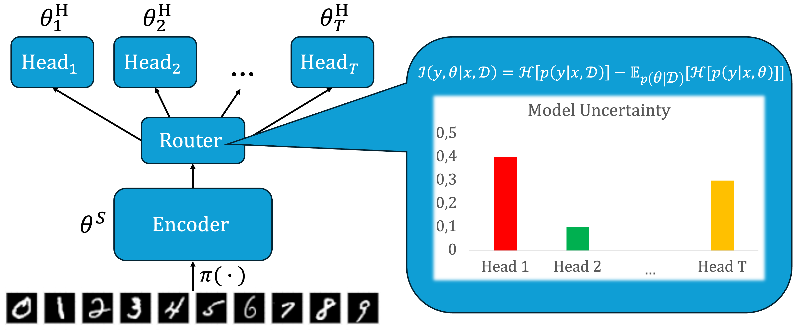

# A Loss Perspective on Symmetric CNN Kernels
Recent machine learning systems are able to surpass human performance in many different
tasks. Yet, most of these models are only experts at a single task. Continual Learning (CL) describes
the setup in which a model is trained on a constant flow of new data. The goal of CL is for the model
to perform well on all tasks seen during training. The importance of CL naturally follows from real-
world scenarios, where we expect deployed machine learning models to continue learning without
forgetting their existing knowledge, known as catastrophic forgetting. This leads to the plasticity-
stability trade-off, which many CL algorithms face. Furthermore, many real-world scenarios do not
provide information about the current task. This requires CL algorithms to differentiate between tasks
on their own. In this report, we replicate experiments for the Variational Continual Learning (VCL)
method by Nguyen et al. This method uses a Bayesian approach to CL. Moreover, we extend
the method by enabling automatic task switch detection and head routing for multi-head architectures
based on the model’s epistemic uncertainty, making it more suitable for real-world applications.



*Figure 1: Visualization of loss barriers between ResNets with different symmetric kernels.*

## Requirements

To install requirements:

```setup
pip install -r requirements_pip.txt
```

### Discriminative Experiment

To run the discriminative experiment, run:

```experiment1
python exp_permutedMNIST.py --configs/
```
Choose a config depending on the kernel symmetry you want.
### Linear Mode Connectivity

To run the generative experiment, run:

```experiment2
python exp_generatedMNIST.py --configs/discriminative/vi_permutedMNIST.yaml
```
### Mandatory Extension

To run the mandatory extension experiment, run:

```experiment3
python exp_permutedMNIST.py --configs/discriminative/vi_reg_generateMNIST.yaml
```
### EURO Extension

To run the EURO experiments, run:

```experiment4
python exp_extensionMNIST.py --configs/extension_permutedMNIST.yaml
```
Use automatic_detection to enable and disable automatic switch detection.

## Results

You can find most of the results of the experiments in the results folder.

## Acknowledgements

This project is part of the course "Uncertainty in Deep Learning" at the University of Oxford (HT25).

## Contact

If you have any questions, feel free to contact me at ...
